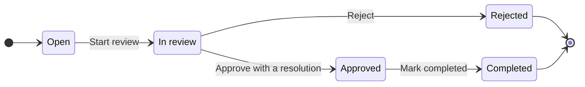

# ReturnDesk


A returns desk for a small online store. When a customer wants to return or replace something, a support agent raises a request, reviews it, approves or rejects it, records the outcome (refund, replacement or store credit), keeps notes along the way and closes it out.

- **Live app:** https://return-desk-frido.vercel.app
- **Code:** https://github.com/Devrajsahani/ReturnDesk-Frido

I built this for the Frido Software Developer Intern take-home (24 hours).

"Agent" here means a person on the support team. There's no login: whoever opens the app is working the desk. Customers never use the app; the agent enters requests on their behalf.

**Contents:**

- [Try it in two minutes](#try-it-in-two-minutes)
- [What it does](#what-it-does)
- [What I added beyond the brief](#what-i-added-beyond-the-brief)
- [Running it locally](#running-it-locally)
- [How the code is organised](#how-the-code-is-organised)
- [The five rules](#the-five-rules-and-where-theyre-enforced)
- [Decisions and why](#decisions-and-why)
- [Problems I ran into](#problems-i-ran-into)
- [Assumptions](#assumptions)
- [Not done yet](#not-done-yet-and-what-id-do-next)
- [Time spent](#time-spent)

---

## Try it in two minutes

The live app runs on the seed data described below.

1. **Find a request.** On the desk, type `Ritika` in the search box. Two requests come back for the same cushion on order `ORD-10421`: `RD-00020` is rejected and `RD-00026` is open. That's rule 3 at work: a second request for the same item was only allowed because the first one was closed.
2. **Work a request.** Filter by _In review_ and open `RD-00010`.
   - Click **Approve…**, choose **Refund** and leave the amount empty. The server refuses, and the dialog shows why.
   - Enter `499` and approve. The status changes, the lifecycle track moves on, and **Edit details** disappears, because decided requests are locked.
3. **Add a note** in the notes panel. It's added at the bottom. Notes have no edit or delete, in the UI or in the API.
4. **Take a request off the desk.** Open `RD-00005` (open) and choose **Remove from desk**. You land back on the desk with a confirmation, and `/requests/RD-00005` now says "Request not found". The row is still in the database, with `deleted_at` set.
5. **Resize to phone width.** Below 640px the table turns into cards. The layout works down to 375px.

The data is shared, so if someone has already moved one of these requests, pick another in the same status.

To see the rules enforced by the server itself (not just hidden buttons), [docs/API.md](docs/API.md#trying-the-rules-with-curl) has curl commands. Each one gets refused with the right status code. They're safe to run against the live URL, because refused requests change nothing.

---

## What it does

| The brief asks for   | How it works here                                                                                                                                                                                                                                                             |
| -------------------- | ----------------------------------------------------------------------------------------------------------------------------------------------------------------------------------------------------------------------------------------------------------------------------- |
| Raise a request      | A form with customer name, email, optional phone, order number, item SKU and name, quantity, and one of the five reasons. The database generates the reference (`RD-00001`, `RD-00002`, …).                                                                                   |
| Find a request       | Search by customer name or email, order number or reference; filter by status and reason (with live counts on each chip); sort; page. All of it runs in parallel SQL queries on the server. The desk state lives in the URL, so refresh, back and shared links keep the view. |
| Work a request       | The detail page shows every field and every note, oldest first. Buttons come from the server's list of allowed actions, so only legal moves are shown.                                                                                                                        |
| Correct details      | Allowed while the request is open or in review. Locked once it's approved, rejected or completed.                                                                                                                                                                             |
| Take it off the desk | A soft delete. The request disappears from the list and returns 404, but the row stays. Only open or rejected requests can be removed.                                                                                                                                        |
| Interface states     | A skeleton while loading, a message plus "Clear filters" when nothing matches, and an error banner with "Try again" when the request fails. Server refusals are shown with the server's own message. Search waits 300 ms after typing stops and cancels older requests.       |
| Seed data            | 36 requests (34 visible and 2 removed) covering every status × reason combination, with notes on 23 of them.                                                                                                                                                                  |

---

## What I added beyond the brief

Once everything the brief asked for was working, I spent the remaining time strengthening what was there rather than adding new screens.

**Live counts on the filters.** Each status and reason chip shows how many requests it would return, for example "Open 6". The counts react to the search box and to the other filter. A dimension ignores its _own_ filter, so with _Open_ selected you can still see how many are _In review_. That's the usual behaviour for faceted search. The counts come from two small `GROUP BY` queries built by the same WHERE builder as the list, so they can never disagree with the results. All four queries (page, total, status counts, reason counts) run in parallel.

**Protection against acting on a stale page.** If two agents open the same request and one of them approves it, the other agent's page is out of date. Every detail response carries a version (an `ETag` based on `updated_at`), and the UI sends it back as `If-Match` on every edit, status change and removal. If the request changed in between, the server answers **412** and the page asks the agent to reload, instead of acting on old information. The header is optional, so plain API calls (like the curl examples) still work. This sits on top of the row locks, which already keep the database consistent. The 412 is about keeping the _person_ in sync.

**Rules the database enforces itself.** The brief asks for server-side enforcement. I went one step further wherever Postgres could express a rule: CHECK constraints for the resolution and refund rules and for removal, a partial unique index for "one live request per item", `ON DELETE RESTRICT` on notes, and a trigger that makes notes impossible to edit or delete, even with direct SQL.

**No avoidable 500s.** Every input has a sensible limit (for example quantity up to 1000, refund up to 99,999,999.99, name up to 120 characters). Oversized values get a 422 with a field message instead of crashing the database with a 500. If the database itself can't be reached, the API returns **503** with a clear message, not a generic 500.

**Tests and CI.** 46 unit tests cover every lifecycle transition and every validation rule, and GitHub Actions runs lint, type checks, the tests and a production build on every push (the badge at the top).

**A considered interface.** A small design system rather than a UI kit:

- colour, radius and motion tokens in one CSS file
- status shown as a coloured square plus a word, never colour alone
- choice tiles (resolution, reason) that lift on hover and press flat when clicked
- confirmation toasts that use the same verb as the button ("Approved RD-00012")
- full keyboard use, visible focus rings, and animation turned off for people who prefer reduced motion
- a custom app icon

**A seed script that's safe to run.** It resets the data and references on every run, so reviewers always start from the same state. It refuses to run against production unless you add `--force`.

---

## Tech stack

- **Next.js 16** (App Router) and **React 19**, with **TypeScript** in strict mode
- **PostgreSQL** on Neon, accessed with **`pg`** and hand-written SQL (no ORM)
- **zod 4** for input validation, with the same schemas used by the API and the forms
- **Tailwind CSS 4**
- Deployed on **Vercel**

---

## Running it locally

You need **Node.js 20.6 or newer**, because the npm scripts use Node's `--env-file`, and any **PostgreSQL 14+** database (local, Docker or Neon).

```bash
git clone https://github.com/Devrajsahani/ReturnDesk-Frido.git
cd ReturnDesk-Frido
npm install

cp .env.example .env
# edit .env and set DATABASE_URL to your database

npm run db:migrate   # creates the schema from db/migrations
npm run db:seed      # loads the 36 sample requests
npm run dev          # http://localhost:3000
```

Some notes:

- `.env` must exist before running `db:migrate` or `db:seed`, or Node stops with `.env: not found`.
- With Neon, use the **pooled** connection string (the host with `-pooler` in it).
- `db:seed` wipes and reloads the two tables every time it runs, and the references restart at `RD-00001`. It refuses to run when `NODE_ENV=production` unless you pass `--force`.
- `db:migrate` records applied files in a `schema_migrations` table, so it's safe to run again.

Other scripts: `npm run lint`, `npm run typecheck`, `npm test`, `npm run build`, and `npm run format` (Prettier).

---

## How the code is organised

```
db/
  migrations/001_init.sql   schema: types, tables, constraints, indexes, trigger
  migrate.ts                applies migrations in order, each in a transaction
  seed.ts                   sample data
src/
  app/api/…                 route handlers (HTTP only)
  lib/services/             business rules and transactions
  lib/queries/              SQL, and mapping rows to API shapes
  lib/domain/               statuses, reasons, the lifecycle rules
  lib/validation/           zod schemas shared by the API and the forms
  app/, components/         pages and UI
```

A request flows **route handler → service → query → database**. Route handlers only deal with HTTP: parsing, validating and shaping the response. Services decide whether something is allowed. Queries only run SQL. So the rules live in one place, and the SQL is easy to find and read.

[docs/CODEMAP.md](docs/CODEMAP.md) lists every file and where each rule is enforced. [docs/DATABASE.md](docs/DATABASE.md) covers the schema, and [docs/API.md](docs/API.md) the endpoints.

---

## The five rules and where they're enforced

Every rule is checked by the server. Where the database can express a rule, it's also enforced by a constraint, so even a bug in the service (or someone writing SQL by hand) can't break it.

The lifecycle (rule 1):



Rejected and Completed are final. Only Open and Rejected requests can be taken off the desk.

| Rule                                                                                               | Server                                                                                        | Database                                                                             |
| -------------------------------------------------------------------------------------------------- | --------------------------------------------------------------------------------------------- | ------------------------------------------------------------------------------------ |
| 1. Status flow: open → in review → approved → completed, and in review → rejected                  | `lifecycle.ts` holds the only transition map; anything else gets **409 `INVALID_TRANSITION`** | (service only; see the decisions below)                                              |
| 2. Approval needs a resolution; a refund needs an amount above 0; other resolutions have no amount | `transitionRequest()` returns **422 `RESOLUTION_REQUIRED`** or **`RESOLUTION_NOT_ALLOWED`**   | CHECK constraints `resolution_matches_status` and `refund_amount_matches_resolution` |
| 3. Only one live request per order + item                                                          | A duplicate becomes **409 `DUPLICATE_LIVE_REQUEST`**, naming the existing reference           | Partial unique index `one_live_request_per_order_item`                               |
| 4. Details locked once decided                                                                     | `updateRequest()` returns **409 `REQUEST_LOCKED`**                                            | (service only)                                                                       |
| 5. Only open or rejected requests can be removed, and removal is a soft delete                     | `removeRequest()` returns **409 `REMOVAL_NOT_ALLOWED`**                                       | CHECK `only_open_or_rejected_removed`; notes use `ON DELETE RESTRICT`                |
| Notes can't be edited or deleted                                                                   | No endpoint exists for it                                                                     | A trigger rejects any `UPDATE` or `DELETE` on `request_notes`                        |

Errors always come back in the same shape, `{ "error": { "code", "message", "details" } }`, with a status code that matches the problem.

---

## Decisions and why

**Hand-written SQL instead of an ORM.** The brief says the reviewers will read the queries, so I wanted them in plain sight. It also made the Postgres features I needed straightforward: a partial unique index, `SELECT … FOR UPDATE`, and CHECK constraints. The cost is more mapping code between rows and objects. Prisma was the alternative, but it can't describe a partial unique index in its schema file.

**Rule 3 lives in a partial unique index, not an "is there already one?" query.** Checking first and then inserting leaves a gap: two agents saving at the same moment would both pass the check. The index covers only live rows (`open`, `in_review`, `approved`, not removed), so the database refuses the second insert, and closed requests don't block new ones. The service turns that refusal into a 409 and looks up the existing reference for the message. The index compares `lower(order_number)` and `lower(item_sku)`, so letter case doesn't matter.

**Status changes have their own endpoint** (`POST /api/requests/:reference/transitions`). Changing status comes with its own rules and inputs (approving needs a resolution), and it's a different kind of action from fixing a typo in a name. Keeping it out of `PATCH` means an edit can never move a request through its lifecycle. `PATCH` rejects any field it doesn't know, including `status`.

**The server tells the UI what's allowed.** The detail response includes `allowedActions` (possible transitions, `canEdit`, `canRemove`), all computed from the same `lifecycle.ts` the API uses. The UI just renders those buttons, so the rules aren't written twice.

**Status codes.** 400 means the request itself is malformed (bad JSON or a bad query parameter). 422 means it's well-formed but the data is invalid. 409 means the data is fine but the request's current state doesn't allow the action. 404 covers missing and removed requests alike. If the database can't be reached, the API returns 503 instead of a generic 500.

**Two kinds of locking.** Edits, status changes and removals load the row with `SELECT … FOR UPDATE` inside a transaction. That's pessimistic locking: two agents acting at the same moment are handled one after the other, and the database stays consistent. The `ETag` / `If-Match` check is optimistic locking. It catches the case where an agent acts on a page that's out of date. I used **412** rather than 409 for that. A 409 means "this action isn't allowed in the request's current state". A 412 means "the version you based this on is no longer current", which is exactly what failed.

**Money** is `numeric(10,2)` in Postgres and a string like `"499.00"` in JSON, so no floating-point rounding ever touches an amount.

**References** come from a Postgres sequence, formatted as `RD-00001`. They're short enough to read out over the phone, unique by construction, and never typed by the agent. Internal ids never leave the server. (The reference format pads to at least five digits and grows past `RD-99999` instead of wrapping.)

**Removal** sets `deleted_at`. Every query filters removed rows out, so a removed request is gone from the list and from every endpoint (404), but the row stays in the table.

**Considered but not built:** separate `customers` and `orders` tables (there's no order system to connect to, so a request stores what the customer told us); database triggers for the lifecycle (the service can return friendlier errors, and the database already guards the data invariants); UUIDs as public ids (too long to read out).

---

## Problems I ran into

**Every button on the live site stopped working after I added the ETag check.** Locally everything worked. In production, every action came back 412 "this request changed". The cause: Vercel compresses responses, and when it does, it turns `ETag: "1789284383543"` into a _weak_ ETag, `W/"1789284383543"`. The browser sent that back, and my comparison didn't expect the `W/` prefix, so nothing ever matched. I found it by sending the same illegal move twice, once with each form of the header: one returned the expected 409 and the other a 412. The fix has two parts. The server now accepts the weak form, and the UI takes the version from the JSON body, so a proxy can't change it. There's a test for both forms.

**A CHECK constraint that would have let bad data in.** My first version of the refund rule was written with `OR`. In Postgres, a CHECK _passes_ when the expression is `NULL`, and `NULL = 'refund'` is `NULL`. So a row with no resolution but a refund amount would have been accepted. I rewrote it as a `CASE`, which always gives a real true or false, and tested it against invalid rows before shipping.

**References would have collided after RD-99999.** `lpad('100000', 5, '0')` doesn't pad, it _truncates_, giving `10000`, a reference that already exists. The reference function now pads to "at least five digits" instead of "exactly five".

**My network blocked the database.** My home connection silently reset every connection to Postgres on port 5432, while HTTPS worked fine. It looked like wrong credentials until I tested the raw TCP connection and the TLS handshake separately. I worked over a mobile hotspot, and the production app (on Vercel) was never affected.

---

## Assumptions

Where the brief left something open, I made these choices:

- **Open → Rejected is not allowed.** The brief's diagram branches Rejected off In Review, and a request should be reviewed before it's turned down.
- **No backward moves** (for example In Review → Open), because the brief lists only forward transitions.
- **Removed requests don't block new ones.** Once a request is off the desk, it's no longer live.
- **Everything the agent entered locks on decision,** including the reason.
- **The resolution is chosen when approving** and can't change afterwards. Rejected requests have no resolution.
- **No login.** Notes store the author's name as typed, and the app remembers it in the browser for the next note.
- **No order catalogue.** Order number, SKU and item name are stored as entered.
- **One currency (INR).**
- **Email is required; phone is optional.**
- **Search is a case-insensitive "contains" match** on reference, order number, customer name and email.
- **No undo for removal,** and notes can't be added to a removed request (it returns 404).

---

## Not done yet, and what I'd do next

- **Integration tests.** Unit tests cover the lifecycle rules and every input validation rule (`npm test`), and run in GitHub Actions on each push. The HTTP behaviour and database constraints were checked with the curl examples in `docs/API.md`. Next step is integration tests against a separate database, one group per rule, running each rule end to end.
- **Search at scale.** `ILIKE '%…%'` can't use a normal index, which is fine at this size. With a lot of data, I'd add `pg_trgm` indexes and measure with `EXPLAIN ANALYZE`. Pagination uses `OFFSET`, which I'd switch to keyset pagination for very deep pages.
- **A history of status changes.** The app records when a request was decided, but not a full log of who changed what and when. An append-only events table shown next to the notes would be the next step.
- **Order lookup.** In a real deployment the agent would type an order number and the customer and item details would be filled in from the store's order system (an API call), instead of being typed. The brief has no order system, so ReturnDesk stores what the agent enters.

---

## Time spent

About 15 hours:

- about 3 on the schema, rules and seed data
- about 4 on the API
- about 6 on the frontend
- about 2 on deployment and fixes
